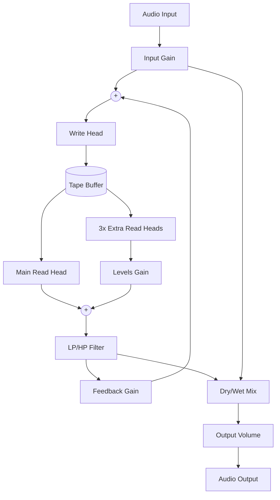

# OutOfThyme

**OutOfThyme** is a JUCE-based audio plugin inspired by the Bastl Thyme "workstation for exploratory delay effects." It features a multi-head digital tape machine with a deep modulation system (Robots) and an integrated sequencer.

## Architecture

The plugin is built on a three-layer architecture:

### 1. Audio Layer (Digital Tape Machine)
A circular buffer simulating a tape loop with:
- **Main Read Head:** Position determined by Coarse and Fine delay.
- **Extra Read Heads:** 3 additional heads with adjustable spacing and levels.
- **Multi-mode Filter:** Morphing LP/HP filter in the feedback path.
- **Freeze Mode:** Instant loop capture with input cutoff.

### 2. Modulation Layer (Robots)
9 independent "Robots" (modulators) that can function as:
- **LFOs:** Multiple waveforms (Triangle, Saw, Pulse, Random).
- **Envelope Followers:** Tracking input amplitude.
- **Stereo Polarity:** Phase-inverted modulation for wide stereo effects.

### 3. Control Layer (Sequencer & Memory)
- **Sounds:** Presets containing all parameter states.
- **Sequencer:** 8-step pattern-based sequencer synced to project BPM.

---

## Signal Flow



## Build Instructions

### Requirements
- **JUCE 7/8**
- **CMake 3.22+**
- **MSVC (Visual Studio 2022)** or any C++17 compliant compiler.

### Build Steps
1. Ensure JUCE is located at `%USERPROFILE%/JUCE`.
2. Open a terminal in the project root.
3. Create and enter the build directory:
   ```bash
   mkdir build
   cd build
   ```
4. Generate and build:
   ```bash
   cmake ..
   cmake --build .
   ```

## License

This project is licensed under the **MIT License** - see the [LICENSE](LICENSE) file for details.
